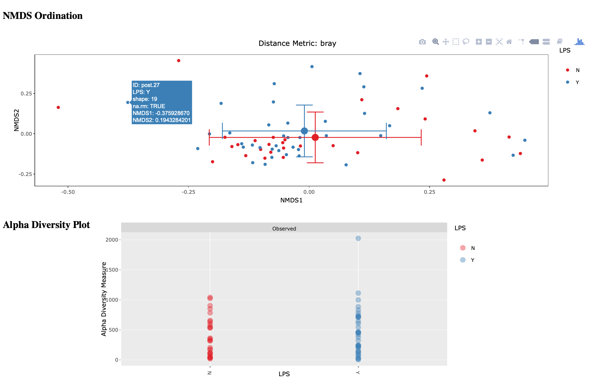

.. _commands:

AMPtk Commands
================
A description for all AMPtk commands.

AMPtk wrapper script
-------------------------------------
AMPtk is a series of Python scripts that are launched from a Python wrapper script.  Each command has a help menu which you can print to the terminal by issuing the command without any arguments, i.e. ``amptk`` yields the following.

.. code-block:: none

    $ amptk
    
    Usage:       amptk <command> <arguments>
    version:     1.3.0

    Description: AMPtk is a package of scripts to process NGS amplicon data.  
                 Dependencies:  USEARCH v9.1.13 and VSEARCH v2.2.0
    
    Process:     ion         pre-process Ion Torrent data
                 illumina    pre-process folder of de-multiplexed Illumina data
                 illumina2   pre-process PE Illumina data from a single file
                 illumina3   pre-process PE Illumina + index reads (i.e. EMP protocol)
                 454         pre-process Roche 454 (pyrosequencing) data
                 SRA         pre-process single FASTQ per sample data (i.e. SRA data)
             
    Clustering:  cluster     cluster OTUs (using UPARSE algorithm)
                 dada2       dada2 denoising algorithm (requires R, dada2, ShortRead)
                 unoise2     UNOISE2 denoising algorithm
                 unoise3     UNOISE3 denoising algorithm
                 cluster_ref closed/open reference based clustering (EXPERIMENTAL)

    Utilities:   filter      OTU table filtering
                 lulu        LULU amplicon curation of OTU table
                 taxonomy    Assign taxonomy to OTUs
                 show        show number or reads per barcode from de-multiplexed data
                 select      select reads (samples) from de-multiplexed data
                 remove      remove reads (samples) from de-multiplexed data
                 sample      sub-sample (rarify) de-multiplexed reads per sample
                 drop        Drop OTUs from dataset
                 stats       Hypothesis test and NMDS graphs (EXPERIMENTAL)
                 summarize   Summarize Taxonomy (create OTU-like tables and/or stacked bar graphs)
                 funguild    Run FUNGuild (annotate OTUs with ecological information) 
                 meta        pivot OTU table and append to meta data
                 heatmap     Create heatmap from OTU table
                 SRA-submit  De-multiplex data and create meta data for NCBI SRA submission

    Setup:       install     Download/install pre-formatted taxonomy DB. Only need to run once.
                 database    Format Reference Databases for Taxonomy
                 info        List software version and installed databases
                 primers     List primers hard-coded in AMPtk. Can use in pre-processing steps.
                 version     List version
                 citation    List citation

AMPtk Pre-Processing
-------------------------------------
amptk ion
^^^^^^^^^^^^^^^^^^^^^^^^^^^^^^^^^^^^^
Script that demulitplexes Ion Torrent data.  Input can be either an unaligned BAM file or FASTQ file. The IonXpress 1-96 barcodes are hard-coded into AMPtk and is the default setting for providing barcode sequences to the script.  Alternatively, you can provide a ``--barcode_fasta`` file containing barcodes used or a QIIME like mapping file.  For file formats see :ref:`here <file-formats>`, and for more information see :ref:`here <pre-processing>`.

.. code-block:: none

    Usage:       amptk ion <arguments>
    version:     1.3.0

    Description: Script processes Ion Torrent PGM data for AMPtk clustering.  The input to this script 
                 should be a FASTQ file obtained from the Torrent Server analyzed with the 
                 `--disable-all-filters` flag to the BaseCaller.  This script does the following: 
                 1) finds Ion barcode sequences, 2) relabels headers with appropriate barcode name,
                 3) removes primer sequences, 4) trim/pad reads to a set length.
    
    Arguments:   -i, --fastq,--bam   Input BAM or FASTQ file (Required)
                 -o, --out           Output base name. Default: out
                 -m, --mapping_file  QIIME-like mapping file
                 -f, --fwd_primer    Forward primer sequence. Default: fITS7
                 -r, --rev_primer    Reverse primer sequence Default: ITS4
                 -b, --barcodes      Barcodes used (list, e.g: 1,3,4,5,20). Default: all
                 -n, --name_prefix   Prefix for re-naming reads. Default: R_
                 -l, --trim_len      Length to trim/pad reads. Default: 300
                 -p, --pad           Pad reads with Ns if shorter than --trim_len. Default: off [on,off]
                 --min_len           Minimum length read to keep. Default: 100
                 --full_length       Keep only full length sequences.
                 --barcode_fasta     FASTA file containing barcodes. Default: pgm_barcodes.fa
                 --barcode_mismatch   Number of mismatches in barcode to allow. Default: 0
                 --primer_mismatch   Number of mismatches in primers to allow. Default: 2
                 --cpus              Number of CPUs to use. Default: all
                 --mult_samples      Combine multiple chip runs, name prefix for chip

amptk illumina
^^^^^^^^^^^^^^^^^^^^^^^^^^^^^^^^^^^^^
Script for demultiplexing Illumina PE data that has been delivered from sequencing center in a folder of PE FASTQ files, one set for each sample. More information is :ref:`here <pre-processing>`.

.. code-block:: none

    Usage:       amptk illumina <arguments>
    version:     1.3.0

    Description: Script takes a folder of Illumina MiSeq data that is already de-multiplexed 
                 and processes it for clustering using AMPtk.  The default behavior is to: 
                 1) merge the PE reads using USEARCH, 2) find and trim primers, 3) rename reads 
                 according to sample name, 4) trim/pad reads to a set length.
    
    Arguments:   -i, --fastq         Input folder of FASTQ files (Required)
                 -o, --out           Output folder name. Default: amptk-data
                 -m, --mapping_file  QIIME-like mapping file
                 -f, --fwd_primer    Forward primer sequence. Default: fITS7
                 -r, --rev_primer    Reverse primer sequence Default: ITS4      
                 -l, --trim_len      Length to trim/pad reads. Default: 300
                 -p, --pad           Pad reads with Ns if shorter than --trim_len. Default: off [on,off]
                 --min_len           Minimum length read to keep. Default: 100
                 --full_length       Keep only full length sequences.
                 --reads             Paired-end or forward reads. Default: paired [paired, forward]
                 --read_length       Illumina Read length (250 if 2 x 250 bp run). Default: auto detect
                 --rescue_forward    Rescue Forward Reads if PE do not merge, e.g. long amplicons. Default: on [on,off]
                 --require_primer    Require the Forward primer to be present. Default: on [on,off]
                 --primer_mismatch   Number of mismatches in primers to allow. Default: 2
                 --barcode_mismatch   Number of mismatches in barcode to allow. Default: 1
                 --cpus              Number of CPUs to use. Default: all
                 --cleanup           Remove intermediate files.
                 --merge_method      Software to use for PE merging. Default: usearch [usearch,vsearch]
                 -u, --usearch       USEARCH executable. Default: usearch9

amptk illumina2
^^^^^^^^^^^^^^^^^^^^^^^^^^^^^^^^^^^^^
This script is for demultiplexing Illumina data that is delivered as either a single FASTQ file or PE FASTQ files where the read layout contains unique barcode sequences at the 5' or the 3' end of the amplicons. More information is :ref:`here <pre-processing>`.

.. code-block:: none

    Usage:       amptk illumina2 <arguments>
    version:     1.3.0

    Description: Script takes Illumina data that is not de-multiplexed and has read structure 
                 similar to Ion/454 such that the reads are <barcode><fwd_primer>Read<rev_primer> for 
                 clustering using AMPtk.  The default behavior is to: 1) find barcodes/primers, 
                 2) relabel headers and trim barcodes/primers, 3) merge the PE reads, 
                 4) trim/pad reads to a set length.  This script can handle dual barcodes 
                 (3' barcodes using the --reverse_barcode option or mapping file). 
    
    Arguments:   -i, --fastq            Illumina R1 (PE forward) reads (Required)
                 --reverse              Illumina R2 (PE reverse) reads.
                 -o, --out              Output base name. Default: illumina2
                 -m, --mapping_file     QIIME-like mapping file
                 -f, --fwd_primer       Forward primer sequence. Default: fITS7
                 -r, --rev_primer       Reverse primer sequence Default: ITS4
                 -n, --name_prefix      Prefix for re-naming reads. Default: R_
                 -l, --trim_len         Length to trim/pad reads. Default: 300
                 -p, --pad              Pad reads with Ns if shorter than --trim_len. Default: off [on,off]
                 --min_len              Minimum length read to keep. Default: 100
                 --barcode_fasta        FASTA file containing barcodes.
                 --reverse_barcode      FASTA file containing R2 barcodes.
                 --barcode_mismatch     Number of mismatches in barcode to allow. Default: 0
                 --barcode_not_anchored Barcodes are not anchored to start of read.
                 --full_length          Keep only full length sequences.
                 --primer_mismatch      Number of mismatches in primers to allow. Default: 2
                 --merge_method         Software to use for PE merging. Default: usearch [usearch,vsearch]
                 --cpus                 Number of CPUs to use. Default: all
                 -u, --usearch          USEARCH executable. Default: usearch9

amptk illumina3
^^^^^^^^^^^^^^^^^^^^^^^^^^^^^^^^^^^^^
This script demultiplexes Illumina PE data that is delivered as 3 files: forward reads (R1), reverse reads (R2), and then index reads (I3). More information is :ref:`here <pre-processing>`.

.. code-block:: none

    Usage:       amptk illumina3/emp <arguments>
    version:     1.3.0

    Description: Script takes PE Illumina reads, Index reads, mapping file and processes 
                 data for clustering/denoising in AMPtk.  The default behavior is to: 
                 1) find and trim primers, 2) merge the PE reads, 3) filter for Phix,
                 4) rename reads according to sample name, 4) trim/pad reads.
    
    Arguments:   -f, --forward       FASTQ R1 (forward) file (Required)
                 -r, --reverse       FASTQ R2 (reverse) file (Required)
                 -i, --index         FASTQ I3 (index) file (Required)
                 -m, --mapping_file  QIIME-like mapping file.
                 -l, --trim_len      Length to trim/pad reads. Default: 300
                 -p, --pad           Pad reads with Ns if shorter than --trim_len. Default: off [on,off]
                 -o, --out           Output folder name. Default: amptk-data  
                 --fwd_primer        Forward primer sequence
                 --rev_primer        Reverse primer sequence
                 --min_len           Minimum length read to keep. Default: 100
                 --read_length       Illumina Read length (250 if 2 x 250 bp run). Default: auto detect
                 --rescue_forward    Rescue Forward Reads if PE do not merge, e.g. long amplicons. Default: on [on,off]
                 --barcode_fasta     Multi-fasta file of barocdes.
                 --primer_mismatch   Number of mismatches in primers to allow. Default: 2
                 --barcode_mismatch  Number of mismatches in index (barcodes) to allow. Default: 2
                 --barcode_rev_comp  Reverse complement barcode sequences in mapping file.
                 --merge_method      Software to use for PE merging. Default: usearch [usearch,vsearch]
                 --cpus              Number of CPUs to use. Default: all
                 --cleanup           Remove intermediate files.
                 -u, --usearch       USEARCH executable. Default: usearch9

amptk 454
^^^^^^^^^^^^^^^^^^^^^^^^^^^^^^^^^^^^^
Script for demultiplexing Roche 454 data.  Input requirements are a 454 run in SFF, FASTQ, or FASTA+QUAL format as well as a multi-FASTA file containing barcodes used. More information is :ref:`here <pre-processing>`.

.. code-block:: none

    Usage:       amptk 454 <arguments>
    version:     1.3.0

    Description: Script processes Roche 454 data for AMPtk clustering.  The input to this script 
                 should be either a SFF file, FASTA+QUAL files, or FASTQ file.  This script does 
                 the following: 1) finds barcode sequences, 2) relabels headers with appropriate 
                 barcode name, 3) removes primer sequences, 4) trim/pad reads to a set length.
    
    Arguments:   -i, --sff, --fasta  Input file (SFF, FASTA, or FASTQ) (Required)
                 -q, --qual          QUAL file (Required if -i is FASTA).
                 -o, --out           Output base name. Default: out
                 -m, --mapping_file  QIIME-like mapping file
                 -f, --fwd_primer    Forward primer sequence. Default: fITS7
                 -r, --rev_primer    Reverse primer sequence Default: ITS4
                 -n, --name_prefix   Prefix for re-naming reads. Default: R_
                 -l, --trim_len      Length to trim/pad reads. Default: 250
                 -p, --pad           Pad reads with Ns if shorter than --trim_len. Default: off [on,off]
                 --min_len           Minimum length read to keep. Default: 50
                 --barcode_fasta     FASTA file containing barcodes. (Required)
                 --reverse_barcode   FASTA file containing 3' barcodes. Default: none
                 --barcode_mismatch  Number of mismatches in barcode to allow. Default: 0
                 --primer_mismatch   Number of mismatches in primers to allow. Default: 2
                 --cpus              Number of CPUs to use. Default: all

amptk SRA
^^^^^^^^^^^^^^^^^^^^^^^^^^^^^^^^^^^^^
This script is useful for pre-processing data from the NCBI SRA or data that is located in a folder where each sample is contained in a single FASTQ file.  Note if you have PE Illumina data that was downloaded from SRA, you can use the ``amptk illumina`` script. More information is :ref:`here <pre-processing>`.

.. code-block:: none

    Usage:       amptk SRA <arguments>
    version:     1.3.0

    Description: Script takes a folder of FASTQ files in a format you would get from NCBI SRA, i.e.
                 there is one FASTQ file for each sample.  Reads will be named according to sample name
                 and workflow is 1) find and trim primers, 2) rename reads according to filename,
                 and 3) trim/pad reads to a set length (optional).
    
    Arguments:   -i, --fastq         Input folder of FASTQ files (Required)
                 -o, --out           Output folder name. Default: amptk-data
                 -m, --mapping_file  QIIME-like mapping file
                 -f, --fwd_primer    Forward primer sequence. Default: fITS7
                 -r, --rev_primer    Reverse primer sequence Default: ITS4      
                 -l, --trim_len      Length to trim/pad reads. Default: 250
                 -p, --pad           Pad reads with Ns if shorter than --trim_len. Default: off [on,off]
                 --min_len           Minimum length read to keep. Default: 50
                 --full_length       Keep only full length sequences.
                 --require_primer    Require the Forward primer to be present. Default: on [on,off]
                 --primer_mismatch   Number of mismatches in primers to allow. Default: 2
                 --cpus              Number of CPUs to use. Default: all
                 --cleanup           Remove intermediate files.
                 -u, --usearch       USEARCH executable. Default: usearch9

AMPtk Clustering
-------------------------------------
amptk cluster
^^^^^^^^^^^^^^^^^^^^^^^^^^^^^^^^^^^^^
UPARSE clustering in AMPtk is completed with this command.  There is optional reference based chimera filtering. More information is :ref:`here <clustering>`.

.. code-block:: none

    Usage:       amptk cluster <arguments>
    version:     1.3.0

    Description: Script is a "wrapper" for the UPARSE algorithm. FASTQ quality trimming via expected 
                 errors and dereplication are run in vsearch if installed otherwise defaults to Python 
                 which allows for the use of datasets larger than 4GB.  
                 Chimera filtering and UNOISE are also options.
    
    Arguments:   -i, --fastq         Input FASTQ file (Required)
                 -o, --out           Output base name. Default: out
                 -e, --maxee         Expected error quality trimming. Default: 1.0
                 -p, --pct_otu       OTU Clustering Radius (percent). Default: 97
                 -m, --minsize       Minimum size to keep (singleton filter). Default: 2
                 --uchime_ref        Run Ref Chimera filtering. Default: off [ITS, LSU, COI, 16S, custom path]
                 --map_filtered      Map quality filtered reads back to OTUs. Default: off
                 --unoise            Run De-noising pre-clustering (UNOISE). Default: off
                 --debug             Keep intermediate files.
                 --cpus              Number of CPUs to use. Default: all
                 -u, --usearch       USEARCH executable. Default: usearch9

amptk dada2
^^^^^^^^^^^^^^^^^^^^^^^^^^^^^^^^^^^^^
DADA2 infers exact sequence variants (ESVs or iSeqs) by using a statistical error model to correct sequencing errors. AMPtk employs a modified DADA2 workflow that also clusters the iSeqs into biological meaningful OTUs.  More information is :ref:`here <clustering>`.

.. code-block:: none

    Usage:       amptk dada2 <arguments>
    version:     1.3.0

    Description: Script is a "wrapper" for the DADA2 pipeline.  It will "pick OTUs" based on denoising
                 the data for each read predicting the original sequence.  This pipeline is sensitive to     
                 1 bp differences between sequences. Since most reference databases classify "species"
                 at 97%% threshold, the inferred sequences (iSeqs) from DADA2 are then clusterd at --pct_otu
                 to create OTUs. Both results are saved.  Requires R packages: dada2, ShortRead
    
    Arguments:   -i, --fastq         Input FASTQ file (Required)
                 -o, --out           Output base name. Default: dada2
                 -m, --min_reads     Minimum number of reads per sample. Default: 10
                 -l, --length        Length to trim reads.
                 -e, --maxee         Expected error quality trimming. Default: 1.0
                 -p, --pct_otu       OTU Clustering Radius (percent). Default: 97
                 --platform          Sequencing platform. [ion, illumina, 454]. Default: ion
                 --pool              Pool all samples together for DADA2. Default: off
                 --uchime_ref        Run Ref Chimera filtering. Default: off [ITS, LSU, COI, 16S, custom path]
                 --cpus              Number of CPUs to use. Default: all
                 --debug             Keep intermediate files.

amptk unoise2
^^^^^^^^^^^^^^^^^^^^^^^^^^^^^^^^^^^^^
UNOISE2 is a denoising algorithm in USEARCH9 that was built to work in a similar fashion to DADA2, correcting reads instead of clustering them. More information is :ref:`here <clustering>`.

.. code-block:: none

    Usage:       amptk unoise2 <arguments>
    version:     1.3.0

    Description: Script will run the UNOISE2 denoising algorithm followed by clustering with
                 UCLUST to generate OTUs. OTU table is then constructed by mapping reads to 
                 the OTUs.  Requires USEARCH v9.0.232 or greater.
    
    Arguments:   -i, --fastq         Input FASTQ file (Required)
                 -o, --out           Output base name. Default: out
                 -e, --maxee         Expected error quality trimming. Default: 1.0
                 -m, --minsize       Minimum size to keep for denoising. Default: 8
                 -p, --pct_otu       OTU Clustering Radius (percent). Default: 97
                 -u, --usearch       Path to USEARCH9. Default: usearch9
                 --uchime_ref        Run Ref Chimera filtering. Default: off [ITS, LSU, COI, 16S, custom path]
                 --cpus              Number of CPUs to use. Default: all
                 --debug             Keep intermediate files.

amptk unoise3
^^^^^^^^^^^^^^^^^^^^^^^^^^^^^^^^^^^^^
UNOISE3 is the successor to UNOISE2 and is a denoising algorithm built from the Illumina platform.  The author suggests that 454 and Ion Torrent data do not work well with this method. More information is :ref:`here <clustering>`.

.. code-block:: none

    Usage:       amptk unoise3 <arguments>
    version:     1.3.0

    Description: Script will run the UNOISE3 denoising algorithm followed by clustering with
                 UCLUST to generate OTUs. OTU table is then constructed by mapping reads to 
                 the OTUs.  Requires USEARCH v10.0.240 or greater.
    
    Arguments:   -i, --fastq         Input FASTQ file (Required)
                 -o, --out           Output base name. Default: out
                 -e, --maxee         Expected error quality trimming. Default: 1.0
                 -m, --minsize       Minimum size to keep for denoising. Default: 8
                 -p, --pct_otu       OTU Clustering Radius (percent). Default: 97
                 -u, --usearch       Path to USEARCH9. Default: usearch9
                 --uchime_ref        Run Ref Chimera filtering. Default: off [ITS, LSU, COI, 16S, custom path]
                 --cpus              Number of CPUs to use. Default: all
                 --debug             Keep intermediate files.

amptk cluster_ref
^^^^^^^^^^^^^^^^^^^^^^^^^^^^^^^^^^^^^
This script runs reference based clustering or rather maps each unique sequence to a reference database using global alignment. If a sequence has no match greather than ``--id``, the remaining sequences are classified using UTAX.

.. code-block:: none

    Usage:       amptk cluster_ref <arguments>
    version:     1.3.0

    Description: Script first quality filters reads, dereplicates, and then runs chimera
                 filtering.  OTUs are then picked via reference based clustering (closed)
                 those that are > --id.  The rest of the data can then be clustered via
                 de novo UPARSE and then reference clustered using UTAX.  EXPERIMENTAL
    
    Arguments:   -i, --fastq         Input FASTQ file (Required)
                 -d, --db            Database [ITS,ITS1,ITS2,16S,LSU,COI,custom]. (Required)
                 -o, --out           Output base name. Default: out
                 -e, --maxee         Expected error quality trimming. Default: 1.0
                 -p, --pct_otu       OTU Clustering Radius (percent). Default: 97
                 -m, --minsize       Minimum size to keep (singleton filter). Default: 2
                 --id                Percent ID for closed reference clustering. Default: 97
                 --utax_db           UTAX formatted DB.
                 --utax_level        UTAX Taxonomy level to keep. Default: k [k,p,c,o,f,g,s]
                 --utax_cutoff       UTAX confidence value threshold. Default: 0.8 [0 to 0.9]
                 --mock              Mock community fasta file
                 --closed_ref_only   Run only closed reference clustering.
                 --map_filtered      Map quality filtered reads back to OTUs. Default: off
                 --debug             Keep intermediate files.
                 --cpus              Number of CPUs to use. Default: all
                 -u, --usearch       USEARCH executable. Default: usearch9

AMPtk Utilities
-------------------------------------
amptk filter
^^^^^^^^^^^^^^^^^^^^^^^^^^^^^^^^^^^^^
Removing index-bleed or sample cross-over from datasets is important for downstream community ecology analysis. AMPtk utilizes a mock community as reference point for calculating the rate of index-bleed between samples.  It than uses that value to remove read counts from an OTU table that fall below the index-bleed threshold. Each OTU is calculated separately, so that low-abundance OTUs are not indiscriminately removed. More information can be found :ref:`here <filtering>`.

.. code-block:: none

    Usage:       amptk filter <arguments>
    version:     1.3.0

    Description: Script filters OTU table generated from the `amptk cluster` command and should 
                 be run on all datasets to combat barcode-switching or index-bleed (as high as 
                 2%% in MiSeq datasets, ~ 0.3%% in Ion PGM datasets).  This script works best when
                 a spike-in control sequence is used, e.g. Synthetic Mock, although a mock is not required.
    
    Required:    -i, --otu_table     OTU table
                 -f, --fasta         OTU fasta
             
    Optional:    -o, --out           Base name for output files. Default: use input basename
                 -b, --mock_barcode  Name of barcode of mock community (Recommended)
                 -m, --mc            Mock community FASTA file. Required if -b passed. [synmock,mock1,mock2,mock3,other]
                 -c, --calculate     Calculate index-bleed options. Default: all [in,all]
                 -d, --drop          Sample(s) to drop from OTU table. (list, separate by space)
                 --negatives         Negative sample names. (list, separate by space)
                 --ignore            Ignore sample(s) during index-bleed calc (list, separate by space)
             
    Filtering    -n, --normalize     Normalize reads to number of reads per sample [y,n]. Default: y
                 -p, --index_bleed   Filter index bleed between samples (percent). Default: 0.005
                 -t, --threshold     Number to use for establishing read count threshold. Default: max [max,sum,top5,top10,top25]
                 -s, --subtract      Threshold to subtract from all OTUs (any number or auto). Default: 0
                 --delimiter         Delimiter of OTU tables. Default: tsv  [csv, tsv]
                 --min_reads_otu     Minimum number of reads for valid OTU from whole experiment. Default: 2
                 --min_samples_otu   Minimum number of samples for valid OTU from whole experiment. Default: 1
                 --col_order         Column order (separate by space). Default: sort naturally
                 --keep_mock         Keep Spike-in mock community. Default: False
                 --show_stats        Show OTU stats on STDOUT  
                 --debug             Keep intermediate files.
                 -u, --usearch       USEARCH executable. Default: usearch9 

amptk lulu
^^^^^^^^^^^^^^^^^^^^^^^^^^^^^^^^^^^^^
Script runs LULU post-clustering OTU table filtering. see doi:10.1038/s41467-017-01312-x

.. code-block:: none

    Usage:       amptk lulu <arguments>
    version:     1.3.0

    Description: Script is a wrapper for the LULU OTU table post-clustering curation of amplicon
                 data. The script calculates pairwise identity between the OTUs and then filters
                 the OTU table based on whether closely related OTUs that share the same/similar
                 distributions in the data are "daughters" of the "parent" OTU. Requires R and the
                 LULU R package. doi:10.1038/s41467-017-01312-x
                 
    Arguments:   -i, --otu_table            Input OTU table (Required)
                 -f, --fasta                Input OTUs in FASTA format (Required)
                 -o, --out                  Output base name. Default: input basename
                 --min_ratio_type           Minimum ratio threshold. Default: min [min,avg]
                 --min_ratio                Minimum ratio. Default: 1
                 --min_match                Minimum match pident (%%). Default: 84
                 --min_relative_cooccurence Minimum relative co-occurance (%%): Default: 95
                 --debug                    Keep intermediate files.
             

amptk taxonomy
^^^^^^^^^^^^^^^^^^^^^^^^^^^^^^^^^^^^^
This script assigns taxonomy to OTUs and an OTU table. A variety of methods are available, more details are located :ref:`here <taxonomy>`. 

.. code-block:: none

    Usage:       amptk taxonomy <arguments>
    version:     1.3.0

    Description: Script maps OTUs to taxonomy information and can append to an OTU table (optional).  
                 By default the script uses a hybrid approach, e.g. gets taxonomy information from 
                 SINTAX, UTAX, and global alignment hits from the larger UNITE-INSD database, and 
                 then parses results to extract the most taxonomy information that it can at 'trustable' 
                 levels. SINTAX/UTAX results are used if BLAST-like search pct identity is less than 97%%.  
                 If % identity is greater than 97%, the result with most taxonomy levels is retained.
                 Run amptk info to see taxonomy databases installed. 
    
    Arguments:   -f, --fasta         Input FASTA file (i.e. OTUs from amptk cluster) (Required)
                 -i, --otu_table     Input OTU table file (i.e. otu_table from amptk cluster)
                 -o, --out           Base name for output file. Default: amptk-taxonomy.<method>.txt
                 -d, --db            Select Pre-installed database [ITS1, ITS2, ITS, 16S, LSU, COI]. Default: ITS2
                 -m, --mapping_file  QIIME-like mapping file
                 -t, --taxonomy      Taxonomy calculated elsewhere. 2 Column file.
                 --method            Taxonomy method. Default: hybrid [utax, sintax, usearch, hybrid, rdp, blast]
                 --add2db            Add FASTA files to DB on the fly.
                 --fasta_db          Alternative database of fasta sequenes to use for global alignment.
                 --utax_db           UTAX formatted database. Default: ITS2.udb [See configured DB's below]
                 --utax_cutoff       UTAX confidence value threshold. Default: 0.8 [0 to 0.9]
                 --usearch_db        USEARCH formatted database. Default: USEARCH.udb
                 --usearch_cutoff    USEARCH threshold percent identity. Default 0.7
                 --sintax_cutoff     SINTAX confidence value threshold. Default: 0.8 [0 to 0.9]
                 -r, --rdp           Path to RDP Classifier. Required if --method rdp
                 --rdp_db            RDP Classifer DB set. [fungalits_unite, fungalits_warcup. fungallsu, 16srrna]  
                 --rdp_cutoff        RDP Classifer confidence value threshold. Default: 0.8 [0 to 1.0]
                 --local_blast       Local Blast database (full path) Default: NCBI remote nt database   
                 --tax_filter        Remove OTUs from OTU table that do not match filter, i.e. Fungi to keep only fungi.
                 -u, --usearch       USEARCH executable. Default: usearch9
                 --cpus              Number of CPUs to use. Default: all
                 --debug             Keep intermediate files

amptk show
^^^^^^^^^^^^^^^^^^^^^^^^^^^^^^^^^^^^^
This utility will count the number of reads for each sample from a demultiplexed FASTQ sample.  Additionally it measures read length for the entire dataset and allows you to quality trim using expected errors.  Note quality trimming is slow in this script and isn't intended to be used for normal amplicon dataset processing.

.. code-block:: none

    Usage:       amptk show <arguments>
    version:     1.3.0

    Description: Script takes de-multiplexed data (.demux.fq) as input and counts reads per barcode.
    
    Required:    -i, --input     Input FASTQ file (.demux.fq)
                 --quality_trim  Quality trim reads
                 -e, --maxee     maxEE threshold for quality. Default: 1.0
                 -l, --length    truncation length for trimming: Default: 250
                 -o, --out       Output FASTQ file name (--quality_trim only)   

amptk select
^^^^^^^^^^^^^^^^^^^^^^^^^^^^^^^^^^^^^
This script allows you to keep samples from a demultiplexed FASTQ sample, useful for keeping samples that have higher than a ``--threshold`` number of reads.

.. code-block:: none

    Usage:       amptk select <arguments>
    version:     1.0.0

    Description: Script filters de-multiplexed data (.demux.fq) to select only reads from samples 
                 provided in a text file, one name per line or pass a list to keep to --list.
    
    Required:    -i, --input      Input FASTQ file (.demux.fq)
                 -t, --threshold  Keep samples with read count greater than -t
                 -l, --list       List of sample (barcode) names to keep, separate by space
                 -f, --file       List of sample (barcode) names to keep in a file, one per line
                 -o, --out        Output file name
                 --format         File format for output file. Default: fastq [fastq, fasta]  

amptk remove
^^^^^^^^^^^^^^^^^^^^^^^^^^^^^^^^^^^^^
This script allows you to drop samples from a demultiplexed FASTQ sample, useful for removing samples that have low read counts or are from potentially a different project. 

.. code-block:: none

    Usage:       amptk select <arguments>
    version:     1.3.0

    Description: Script filters de-multiplexed data (.demux.fq) to select only reads from samples 
                 provided in a text file, one name per line or pass a list to keep to --list.
    
    Required:    -i, --input      Input FASTQ file (.demux.fq)
                 -t, --threshold  Keep samples with read count greater than -t
                 -l, --list       List of sample (barcode) names to keep, separate by space
                 -f, --file       List of sample (barcode) names to keep in a file, one per line
                 -o, --out        Output file name
                 --format         File format for output file. Default: fastq [fastq, fasta]  

amptk sample
^^^^^^^^^^^^^^^^^^^^^^^^^^^^^^^^^^^^^
This script will sub-sample or pseudo-rarefy a dataset to an equal number of reads per sample.  Note, this should not be used during standard amplicon community analysis, however, there are some fringe use cases where it is appropriate.

.. code-block:: none

    Usage:       amptk sample <arguments>
    version:     1.3.0

    Description: Script sub-samples (rarifies) de-multiplexed data to equal number of reads per 
                 sample. For community analysis, this might not be appropriate as you are ignoring 
                 a portion of your data, however, there might be some applications where it is useful.
    
    Required:    -i, --input       Input FASTQ file
                 -n, --num_reads   Number of reads to sub-sample to
                 -o, --out         Output FASTQ file name     

amptk drop
^^^^^^^^^^^^^^^^^^^^^^^^^^^^^^^^^^^^^
This script allows you to drop OTUs from an OTU table.  Usage example would be that you identify OTUs that are from contamination and you want to remove them from the OTU table.  

.. code-block:: none

    Usage:       amptk drop <arguments>
    version:     1.3.0

    Description: Script drops OTUs from dataset and outputs new OTU table
    
    Required:    -i, --input     Input OTU file (.cluster.otus.fa) (FASTA)
                 -r, --reads     Demultiplexed reads (.demux.fq) (FASTQ)
                 -l, --list      List of OTU names to remove, separate by space
                 -f, --file      List of OTU names to remove in a file, one per line
                 -o, --out       Output file name. Default: amptk-drop

amptk stats
^^^^^^^^^^^^^^^^^^^^^^^^^^^^^^^^^^^^^
This script is a wrapper for Vegan/Phyloseq and is meant as a first pass overview of your community ecology data.  The script takes a BIOM file containing OTU table, taxonomy, and metadata (output of ``amptk taxonomy``). The script than loops through all metadata and returns a hypothesis test (Adonis and Betadisper), an NMDS graph of the data, and an alpha diversity graph. This script requires R, Vegan, and Phyloseq.  Script is considered beta as it is new.

.. code-block:: none

    Usage:       amptk stats <arguments>
    version:     1.3.0

    Description: A wrapper script for Phyloseq and Vegan R packages that draws NMDS of all 
                 treatments in a BIOM file (output from amptk taxonomy). The script also runs 
                 hypothesis tests (Adonis and Betadispersion) for each treatment.
    
    Arguments:   -i, --biom          Input BIOM file with taxonomy and metadata (Required)
                 -t, --tree          Phylogeny of OTUs (from amptk taxonomy) (Required)
                 -d, --distance      Distance metric. Default: raupcrick [raupcrick,jaccard,bray,unifrac,wunifrac]
                 -o, --out           Output base name. Default: amptk_stats
                 --ignore_otus       Drop OTUs from table before running stats

**Example 1**:

.. code-block:: none

    amptk stats -i test.biom -t test.tree.phy -o test_stats
    -------------------------------------------------------
    [Feb 06 09:08 PM]: OS: MacOSX 10.14.3, 8 cores, ~ 17 GB RAM. Python: 3.6.7
    [Feb 06 09:08 PM]: R v3.5.1; Phyloseq v1.26.0
    [Feb 06 09:08 PM]: Running hypothesis test using bray distance metric on all treatments, drawing NMDS for each.
    [Feb 06 09:10 PM]: HTML output files were generated for each treatment: test_stats
    -------------------------------------------------------

The script will loop through your treatments and generate an HTML page for each treatment displaying an NMDS ordination, alpha diversity, and some summary stats. Hover-over is enabled on the ordination so you can easily identify outliers.

amptk summarize
^^^^^^^^^^^^^^^^^^^^^^^^^^^^^^^^^^^^^
This script will traverse the taxonomy tree from an OTU table that is appended with taxonomy information, i.e. the output of ``amptk taxonomy``.  It can optionally produce stacked bar graphs of taxonomy for each level of taxonomy.
 
.. code-block:: none

    Usage:       amptk summarize <arguments>
    version:     1.3.0

    Description: Script traverses the taxonomy information and creates an OTU table for each
                 level of taxonomy, i.e. Kingdom, Phylum, Class, etc.  Optionally, it will 
                 create a Stacked Bar Graph for each taxonomy levels for each sample. Requires 
                 Matplotlib, numpy, and pandas.
    
    Arguments:   -i, --table     OTU Table containing Taxonomy information (Required)
                 -o, --out       Base name for output files. Default: amptk-summary
                 --graphs        Create stacked Bar Graphs.
                 --format        Image output format. Default: eps [eps, svg, png, pdf]
                 --percent       Convert numbers to Percent for Graphs. Default: off
                 --font_size     Adjust font size for X-axis sample lables. Default: 8
                 
**Example 1**:

.. code-block:: none

    amptk summarize -i test.otu_table.taxonomy.txt --graphs -o test --font_size 6 --format pdf

.. image:: summarize.pdf
    :align: center 

**Example 2**:

.. code-block:: none

    amptk summarize -i test.otu_table.taxonomy.txt --graphs -o test --font_size 6 --format pdf --percent

.. image:: summarize-percent.pdf
    :align: center 

amptk funguild
^^^^^^^^^^^^^^^^^^^^^^^^^^^^^^^^^^^^^
`FunGuild <http://www.stbates.org/guilds/app.php>`_ is a tool for assigning functional information to OTUs.  You use this script by simply providing an OTU table that has been appended with taxonomy, i.e. the ``otu_table.taxonomy.txt`` from ``amptk taxonomy``. 

.. code-block:: none

    Usage:       amptk funguild <arguments>
    version:     1.3.0

    Description: Script takes OTU table as input and runs FUNGuild to assing functional annotation to an OTU
                 based on the Guilds database.  Guilds script written by Zewei Song (2015).  
    
    Options:     -i, --input        Input OTU table
                 -d, --db           Database to use [fungi, nematode]. Default: fungi
                 -o, --out          Output file basename.

amptk meta
^^^^^^^^^^^^^^^^^^^^^^^^^^^^^^^^^^^^^
This script is an alternative to using BIOM file format for downstream processing.  It takes a metadata file in CSV format with the first column having sample IDs that match sample IDs in an OTU table.  The script than pivots the OTU table and appends it to the metadata, which can be imported into something like Vegan in R.

.. code-block:: none

    Usage:       amptk meta <arguments>
    version:     1.3.0

    Description: Script takes meta data file in CSV format (e.g. from excel) and an OTU table as input.  
                 The first column of the meta data file must match the OTU table sample headers exactly.  
                 It then pivots the OTU table and appends it to the meta data file.  
    
    Required:    -i, --input       Input OTU table
                 -m, --meta        Meta data table (csv format)
                 -o, --out         Output (meta data + pivotted OTU table)
                 --split_taxonomy  Make separate tables for groups of taxonomy [k,p,c,o,f,g]  

amptk heatmap
^^^^^^^^^^^^^^^^^^^^^^^^^^^^^^^^^^^^^
Transform your OTU table into a heatmap using Seaborn and Matplotlib. 

.. code-block:: none

    Usage:       amptk heatmap <arguments>
    version:     1.3.0

    Description: Script creates a heatmap from an OTU table.  Several settings are customizable.  
                 Requires Seaborn, matplotlib, numpy, and pandas.

    Arguments:   -i, --input         Input OTU table (Required)
                 -o, --output        Output file (Required)
                 -m, --method        Type of heatmap. Default: clustermap [clustermap,heatmap]
                 -d, --delimiter     Delimiter of OTU table. Default: tsv [tsv,csv]
                 -f, --format        Figure format. Default: pdf [pdf,jpg,svg,png]
                 --font              Font set. Default: arial
                 --color             Color Palette. Default: gist_gray_r
                 --figsize           Figure size. Default: 2x8
                 --annotate          Annotate heatmap with values.
                 --distance_metric   Distance metric to use for clustermap. Default: braycurtis
                 --cluster_columns   Cluster the columns (samples). Default: False [True,False]
                 --cluster_method    Clustering method for clustermap. Default: single [single,complete,average,weighted]
                 --scaling           Scale the data by row. Default: None [None, z_score, standard]
                 --yaxis_fontsize    Y-Axis Font Size. Default: 6
                 --xaxis_fontsize    X-Axis Font Size. Default: 6
                 --normalize         Normalize data based total, tsv file ID<tab>count
                 --normalize_counts  Value to normalize counts to, i.e. 100000
                 --vmax              Maximum value for heatmap coloration.
                 --debug             Print pandas table on import to terminal

amptk SRA-submit
^^^^^^^^^^^^^^^^^^^^^^^^^^^^^^^^^^^^^
Submitting your data to NCBI SRA can be a real pain, this script tries to make it easier to make that happen.  Data submitted to SRA needs to be split up by sample, however it should also be minimally processed -> what I mean by that is that Illumina data should be raw (output of bcl2fastq for example) and 454/Ion Torrent data should be demultiplexed based on sample, but otherwise should not be trimmed.  This is where ``amptk SRA-submit`` can help.  The script takes the raw input and outputs gzipped FASTQ files that are minimally processed for SRA.  Moreover, if you create a BioProject and BioSamples for each of your samples prior to running the script, you can bass the BioSample worksheet from NCBI to the script and it will automatically generate an SRA submission file.  You can customize some of the text in that file, i.e. via the ``--description`` argument. 

.. code-block:: none

    Usage:       amptk SRA-submit <arguments>
    version:     1.3.0

    Description: Script aids in submitted your data to NCBI Sequence Read Archive (SRA) by splitting 
                 FASTQ file from Ion, 454, or Illumina by barcode sequence into separate files for 
                 submission to SRA.  This ensures your data is minimally processed as only barcodes
                 are removed.  However, you can assert that primers must be found in order for 
                 sequences to be processed.  Additionally, you can pass the --biosample argument 
                 with an NCBI biosample tab-delimited file and the script will auto-populate an 
                 SRA submission file.
    
    Arguments:   -i, --input         Input FASTQ file or folder (Required)
                 -o, --out           Output base name. Default: sra
                 -m, --mapping_file  QIIME-like mapping file.
                 -b, --barcode_fasta Mulit-fasta file containing barcodes used.
                 -s, --biosample     BioSample worksheet from NCBI (from confirmation email)
                 -p, --platform      Sequencing platform. Defalt: ion (ion, illumina, 454)
                 -n, --names         CSV name mapping file, e.g. BC_1,NewName
                 -d, --description   Paragraph description for SRA experimental design. Use quotes to wrap paragraph.
                 -f, --fwd_primer    Forward primer sequence. Default: fITS7
                 -r, --rev_primer    Reverse primer sequence. Default: ITS4
                 -a, --append        Append a name to the output of all files in run, i.e. run1 -> Sample_run1
                 --primer_mismatch   Number of mismatches allowed in primer search. Default: 2
                 --barcode_mismatch  Number of mismatches in barcode to allow. Default: 0
                 --require_primer    Require primer(s) to be present for output. Default: off [off,forward,both]
                 --min_len           Minimum length read to keep after trimming barcodes. Default 50
                 ---force            Overwrite directory with same name
 

AMPtk Setup
-------------------------------------
amptk install
^^^^^^^^^^^^^^^^^^^^^^^^^^^^^^^^^^^^^
This simple script will download and unpack the pre-build reference databases.

.. code-block:: none

    Usage:       amptk install <arguments>
    version:     1.3.0

    Description: Script downloads pre-formated databases for use with the `amptk taxonomy` 
                 command. You can download databases for fungal ITS, bacterial 16S, fungal
                 LSU, or arthropod/chordate COI amplicons. 
    
    Arguments:   -i            Install Databases. Choices: ITS, 16S, LSU, COI
                 --force       Over-write existing databases

amptk database
^^^^^^^^^^^^^^^^^^^^^^^^^^^^^^^^^^^^^
Building reference databases is done with ``amptk database``.  It has built-in parsers for UNITE and RDP FASTA headers, see the discussion about `AMPtk taxonomy <taxonomy>` for more information on FASTA headers. 

.. code-block:: none

    Usage:       amptk database <arguments>
    version:     1.3.0

    Description: Setup/Format reference database for amptk taxonomy command.
    
    Arguments:   -i, --fasta         Input FASTA file
                 -o, --out           Base name for output files, i.e. ITS2
                 -f, --fwd_primer    Forward primer. Default: fITS7
                 -r, --rev_primer    Reverse primer. Default: ITS4
                 --format            Reformat FASTA headers to UTAX format. Default: unite2utax [unite2utax, rdp2utax, off]
                 --drop_ns           Removal sequences that have > x N's. Default: 8
                 --create_db         Create a DB. Default: usearch [utax, usearch]
                 --skip_trimming     Keep full length sequences. Default: off
                 --derep_fulllength  Remove identical sequences.
                 --lca               Run LCA (last common ancestor) on taxonomy if dereplicating sequences.
                 --min_len           Minimum length to keep. Default: 100
                 --max_len           Maximum length to keep. Default: 1200
                 --trunclen          Truncate records to length.
                 --subsample         Random subsample reads.
                 --primer_mismatch   Max Primer Mismatch. Default: 2
                 --keep_all          Keep Sequence if forward primer not found.
                 --utax_trainlevels  UTAX custom parameters. Default: kpcofgs
                 --utax_splitlevels  UTAX custom parameters. Default: NVkpcofgs
                 --cpus              Number of CPUs to use. Default: all
                 --install           Install into AMPtk Database
                 -u, --usearch       USEARCH executable. Default: usearch9       

amptk primers
^^^^^^^^^^^^^^^^^^^^^^^^^^^^^^^^^^^^^
This command lists the primers that are available via their names.  You can always input the actual primer sequence.

.. code-block:: none

    ----------------------------------
    Primers hard-coded into AMPtk:
    ----------------------------------
    16S_V3       CCTACGGGNGGCWGCAG
    16S_V4       GACTACHVGGGTATCTAATCC
    515FB        GTGYCAGCMGCCGCGGTAA
    806RB        GGACTACNVGGGTWTCTAAT
    COI-F        GGTCAACAAATCATAAAGATATTGG
    COI-R        GGWACTAATCAATTTCCAAATCC
    ITS1         TCCGTAGGTGAACCTGCGG
    ITS1-F       CTTGGTCATTTAGAGGAAGTAA
    ITS2         GCTGCGTTCTTCATCGATGC
    ITS3         GCATCGATGAAGAACGCAGC
    ITS3_KYO2    GATGAAGAACGYAGYRAA
    ITS4         TCCTCCGCTTATTGATATGC
    ITS4-B       CAGGAGACTTGTACACGGTCCAG
    ITS4-B21     CAGGAGACTTGTACACGGTCC
    JH-LS-369rc  CTTCCCTTTCAACAATTTCAC
    LR0R         ACCCGCTGAACTTAAGC
    LR2R         AAGAACTTTGAAAAGAG
    fITS7        GTGARTCATCGAATCTTTG

